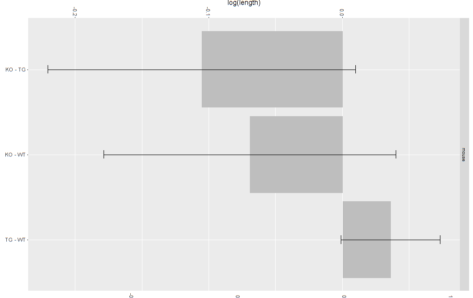
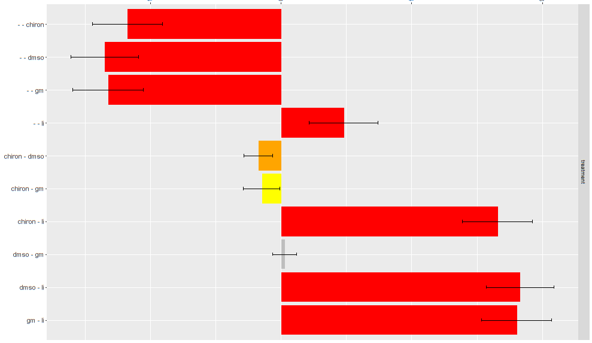
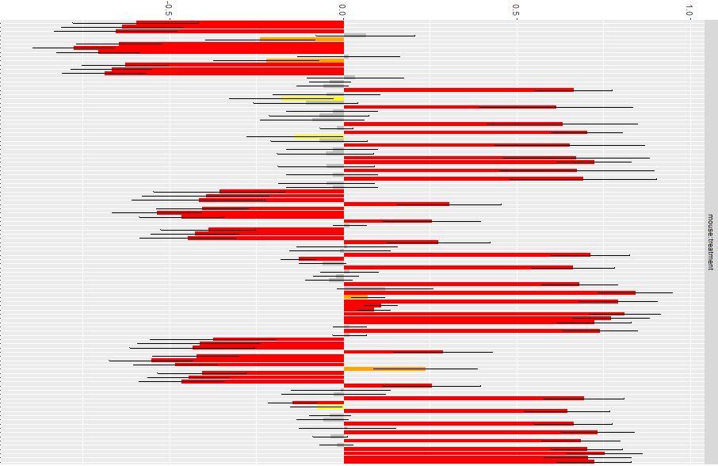

Project 2: Phase3 
========================================================
author: Michal Frej, Karolina Gajewska, Agnieszka Sitko, Marcin Wojno
date: Modele liniowe i mieszane
font-import: https://fonts.googleapis.com/css?family=Open+Sans
font-family: 'Open Sans'

Introduction (do podzialu)
========================================================
*opis bazy danych.*
*Tu sie skupiamy tylko na mouse i treatment - krotko opisac, jakie zaleznosci miedzy treatment a mouse mozna zauwazyc na boxplotach.*
*Czego bedziemy sie spodziewac* 
<b> Main goal: find out which treatments affect length of dendritic spines for different mice. </b>

Assumption
========================================================
- mouse type cannot be changed during a study. So one mouse has only one type in a study.

Results (KG)
========================================================
*drzewo decyzyjne*

How did we get here? 
========================================================   
1. Creating a model. 
      - what other variables may be considered?
2. Choosing the right model.
      - which model suits our data best?
3. Backward elimination.

Creating a model: study effect
========================================================   
left: 60%

***

|   | chiron|   gm|   ko|
|:--|------:|----:|----:|
|KO |      0|    0| 3066|
|TG |   6926| 9233|    0|
|WT |   6028| 9483| 3446|

|       | chiron|   gm|   ko|
|:------|------:|----:|----:|
|-      |      0|    0| 2916|
|chiron |   6158|    0|    0|
|dmso   |   6796| 8922|    0|
|gm     |      0| 9794|    0|
|li     |      0|    0| 3596|

Creating a model: other effects
========================================================

- individual effect of a mouse,
- indiidual effect of a photo.

Choosing the right model
========================================================
left: 40%

***
 
 
<b>First model: </b> 
`log(length) ~ treatment`
  

<b>Final model: </b> 
`log(length) ~ mouse * treatment + (1|study:animal/photoID)`

Backward elimination (do podzialu)
========================================================
*Opis wykresu*

Backward elimination: mouse type 
========================================================

Backward elimination: treatment  
========================================================

Backward elimination: interactions
========================================================

Graphical presentation (do podzialu)
========================================================
*Co nam przyjdzie do g³owy*

Diagnostics (do podzialu)
========================================================
We have checked if the assumptions of mixed models are fullfilled. The assumptions are as follow:
- 
- 
- 

 
It turned out that our model is well constructed.

Conclusions (koniec)
========================================================

