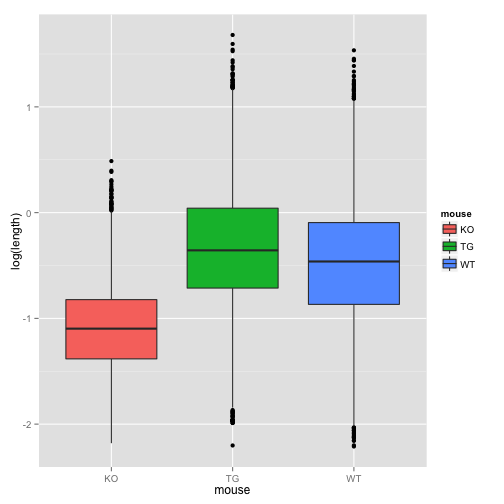
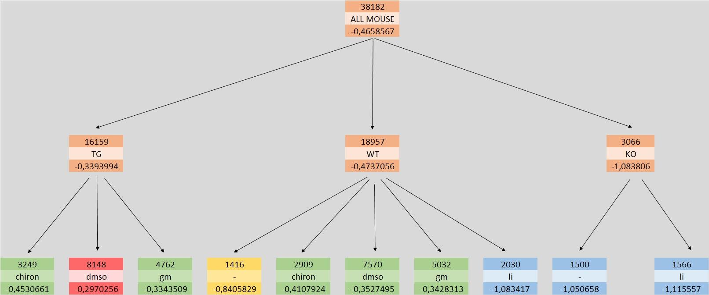
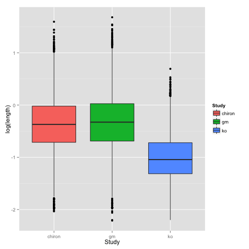
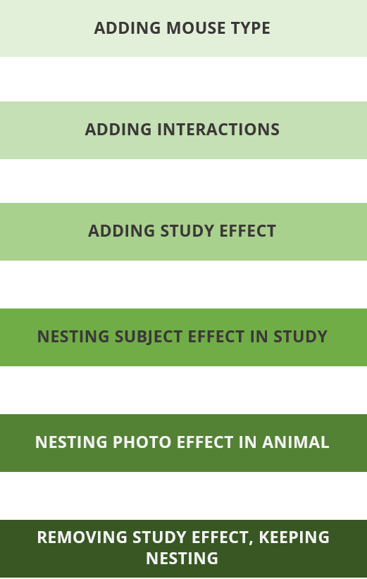
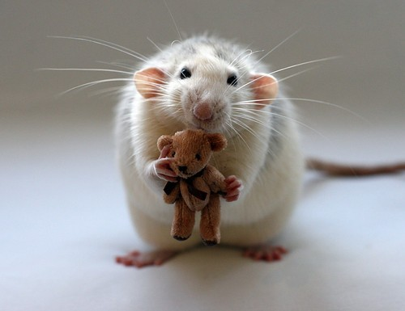

Project 2: Phase3 
========================================================
author: Michal Frej, Karolina Gajewska, Agnieszka Sitko, Marcin Wojno
date: Modele liniowe i mieszane
font-import: https://fonts.googleapis.com/css?family=Open+Sans
font-family: 'Open Sans'

Agenda
========================================================
- Introduction
    * dataset description
    * problem statement
    * main factors
- Results
- Model creation - other factors taken into account
- Diagnostics
- Conclusions

Introduction
========================================================
`Dendritic spines` is a dataset collected from three different studies. In this project we examine whether there are any relations between mice's length of dendtric spines* and other factors.  
In the final phase our main goal will be to <b> find out which treatments affect length of dendritic spines for different mice. </b>

 
*In this analysis we applied logarythmic transformation to the dependent variable to make it follow normal distribution. 

Treatment
========================================================
We consider five types of treatment:

- *no treatment* (-),
- *lit*,
- some other substances (*gm*, *dmso*, *chiron*).

In our model we <b>set base level of `treatment` at "no treatment"</b>.

Mouse type
========================================================
Analyzing data visually (see next slide), we suspect that treatments may have different effects on different type of mouse. Therefore, we add a variable which describes type of mouse. We consider three types of mouse: 
- *WT* (wild type) normal mice,
- *TG* (transgenic) mice with additional genetic material and
- *KO* (knock out) mice with a removed gene.  
<b>Our base level is "WT".</b>  
We also make a following assumption:
- mouse type cannot be changed during a study. So each pair of sets of mouse types are disjoint.

Mouse type
========================================================
left:25%
***
 

Results
========================================================

How did we get here? 
========================================================   
1. Creating a model. 
      - what other variables may be considered?
2. Choosing the right model.
      - which model suits our data best?
3. Parameters estimation and pairwise comparisons.

Creating a model: study effect
========================================================   
left: 60%
 

***

|   | chiron|   gm|   ko|
|:--|------:|----:|----:|
|KO |      0|    0| 3066|
|TG |   6926| 9233|    0|
|WT |   6028| 9483| 3446|

|       | chiron|   gm|   ko|
|:------|------:|----:|----:|
|-      |      0|    0| 2916|
|chiron |   6158|    0|    0|
|dmso   |   6796| 8922|    0|
|gm     |      0| 9794|    0|
|li     |      0|    0| 3596|

Creating a model: other effects
========================================================

- individual effect of a mouse,
- indiidual effect of a photo.

Choosing the right model
========================================================
left: 40%

***
 
 
<b>First model: </b> 
`log(length) ~ treatment`
  

<b>Final model: </b> 
`log(length) ~ mouse * treatment + (1|study:animal/photoID)`

Diagnostics 
========================================================
We have checked if the assumptions of mixed models are fullfilled. The assumptions are as follow:
- normality of residuals,
- normality of random components,
- model residuals and random effects independence.

 
It turned out that our model is well constructed and all variables are significant.

Results - parameters estimates
========================================================
left:10%
***
|                        | fixed effects         | p-values         |
|:-----------------------|----------------------:|-----------------:|
|(Intercept)             |                  -0.83|            0.0000|
|mouseKO                 |                  -0.22|            0.0013|
|mouseTG                 |                   0.02|            0.4722|
|treatmentchiron         |                   0.41|            0.0000|
|treatmentdmso           |                   0.45|            0.0000|
|treatmentgm             |                   0.47|            0.0000|
|treatmentli             |                  -0.25|            0.0001|
|mouseTG:treatmentchiron |                  -0.01|            0.8750|
|mouseTG:treatmentdmso   |                   0.09|            0.0120|
|mouseKO:treatmentli     |                   0.19|            0.0364|

Least squere means analysis
========================================================
left:23%

***

|          |means |groups |
|:---------|:-----|:------|
|TG:dmso   |-0.29 |a      |
|TG:gm     |-0.33 |b      |
|WT:gm     |-0.34 |b      |
|WT:dmso   |-0.35 |b      |
|WT:chiron |-0.41 |b      |
|TG:chiron |-0.45 |b      |
|WT:-      |-0.84 |c      |
|KO:-      |-1.05 |d      |
|WT:li     |-1.08 |d      |
|KO:li     |-1.11 |d      |

Conclusions
========================================================
- all treatments affect spine length.
- if we take "no treatment" as a base level, chiron, dmso and gm treatments have in general positive influence on length, while li - negative.
- we cannot neglect the KO type effect in dendritic spine lengths analysis. We notice that KO mice spines are shorter in comparison to WT mice spines. However, WT and TG mice have spines of similar length.
- an important element are some interactions between treatment and mouse type (TG:dmso - positive, KO:li - positive). 

========================================================
   
<h2>Thank you!  Questions?</h2>

