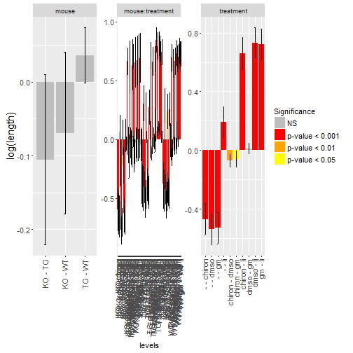

Project 2: Phase3 
========================================================
author: Michal Frej, Karolina Gajewska, Agnieszka Sitko, Marcin Wojno
date: Modele liniowe i mieszane

Introduction (do podzialu)
========================================================
*opis bazy danych.*
*Tu sie skupiamy tylko na mouse i treatment - krotko opisac, jakie zaleznosci miedzy treatment a mouse mozna zauwazyc na boxplotach.*
*Czego bedziemy sie spodziewac*

Assumption
========================================================
- mouse type cannot be changed during a study. So one mouse has only one type in a study.

Results (KG)
========================================================
*drzewo decyzyjne*

How did we get here? (AS)
========================================================
*opis pozostalych zmiennych, w jaki sposob je dodac do modelu*

How did we get here? (AS)
========================================================
*rysunek z modelami*

Final model 
========================================================
$$\log(length)_i = WT_i + TG_i + \ \epsilon_i$$

ANOVA results (AS)
========================================================
*Ten wykres trzeba bêdzie poprawiæ. Wezme srodkowy wykres i go powieksze*

ANOVA results (do podzialu)
========================================================
*Opis wykresu*

Graphical presentation (do podzialu)
========================================================
*Co nam przyjdzie do g³owy*

Diagnostics (do podzialu)
========================================================
We have checked if the assumptions of mixed models are fullfilled. The assumptions are as follow:
- 
- 
- 
It turned out that our model is well constructed.

Conclusions (koniec)
========================================================

